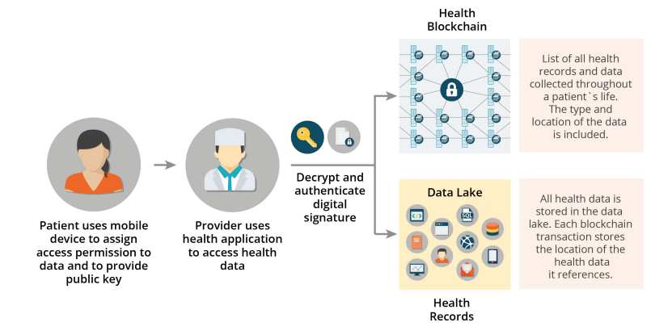
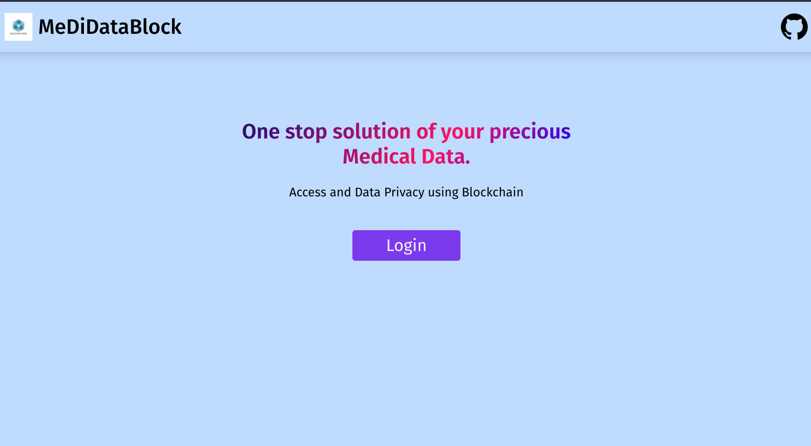
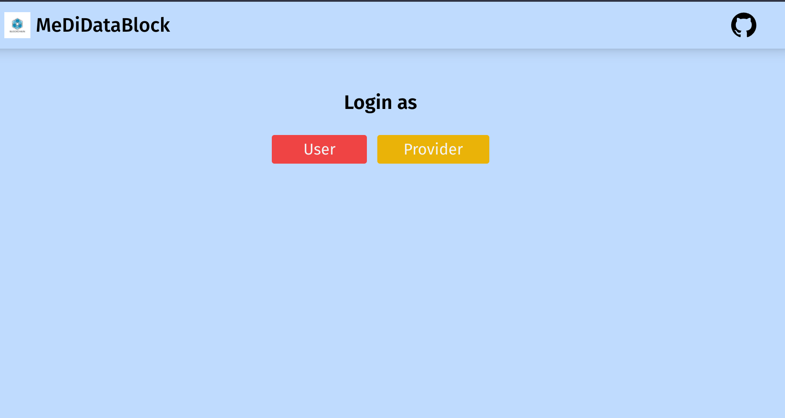
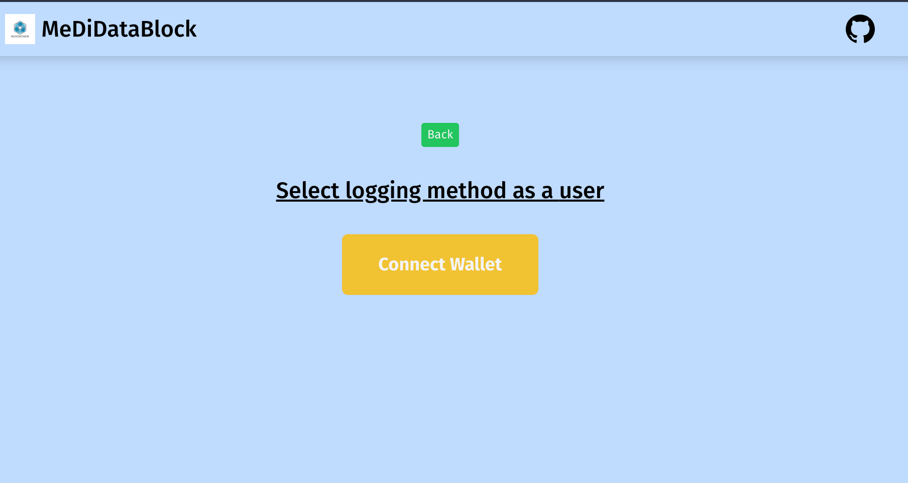
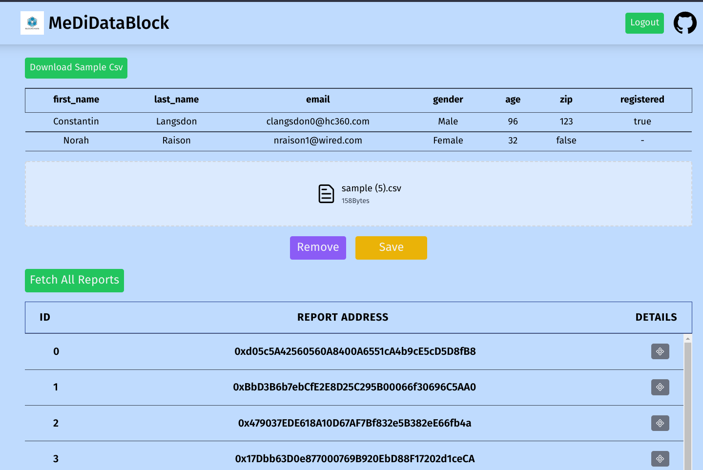
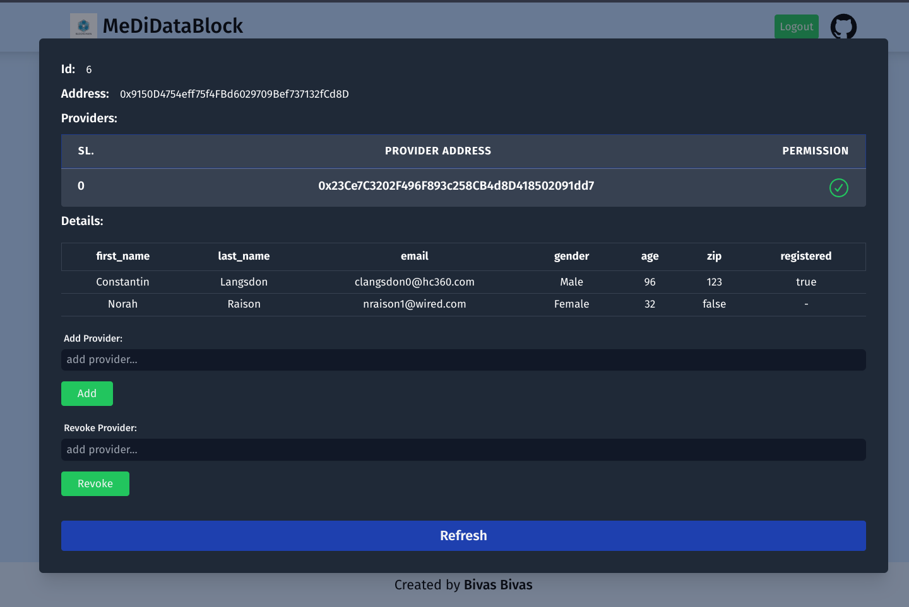
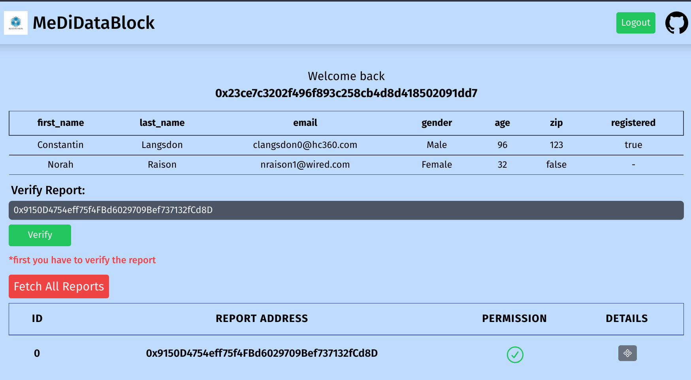
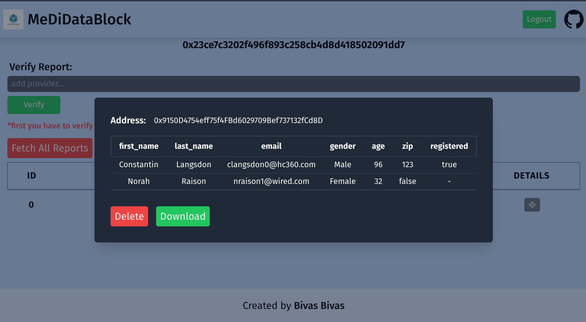

[![MIT License][license-shield]][license-url]
[![Twitter][twitter-shield]][twitter-url]
[![LinkedIn][linkedin-shield]][linkedin-url]

<!-- PROJECT LOGO -->

# 🔩 MeDiDataBlock

 

  
    <h3 align="center">MeDiDataBlock</h3>
  

  A Task Managing App, Track your work with time.
     
    <a href="https://github.com/Bivas-Biswas/Medical-Data-Privacy-using-Blockchain/#kajmanage"><strong>Explore the docs »</strong></a>
     
     
    <a href="https://Medical-Data-Privacy-using-Blockchain.vercel.app/">View Demo</a>
    ·
    <a href="https://github.com/Bivas-Biswas/Medical-Data-Privacy-using-Blockchain/issues">Report Bug</a>
    ·
    <a href="https://github.com/Bivas-Biswas/Medical-Data-Privacy-using-Blockchain/issues">Request Feature</a>
  

<!-- TABLE OF CONTENTS -->

# 🛒 Table of Contents

[Contents](#table-of-contents)

- [Inspiration](#inspiration)
- [What it does](#what-it-does)
- [Showcase](#-showcase)
- [Built With](#-built-with)
- [License](#-license)
- [Acknowledgements](#acknowledgements)

## Inspiration

In Machine Learning field the problem is "how to get the accurate data?" like in medical field we have the more accurate and more improvement in healthcare.

The user would have full access to his data and control over how his data would be shared. The
user would assign a set of access permissions and designate who can query and write data to
his blockchain. A dashboard application would allow the user to see who has
permission to access his blockchain. The user would also be able to view an audit log of who
accessed his blockchain, including when and what data was accessed. The same dashboard
would allow the user to give and revoke access permissions to any individual who has a unique
identifier.

So I made this project resolved this problem.

## What it does

It is a web dashboard for uploading and accessing the medical reports.

It divide into two types of users -

**1. User:**

- can upload medical reports as csv
- give read access to individual reports to individual providers.
- revoke read access from individual reports from individual providers

**2. Provider:**

- Provider can verify reports with the report address.
- Can view and download the report.
- Can check which user revoke access for which report.
- Store all reports.

    
    
Whole system

## 📸 Showcase

<table align="center">
    <tr>
        <td>
                

                    
                    
Home

                

        </td>
        <td> 

                    
                    
Login

                

        </td>
        <td> 

                    
                    
Wallet

                

        </td>
    </tr>
    </table>
   <b>
User View
</b>
    <table align="center">
    <tr>
        <td>
                

                    
                    
Dashboard

                

        </td>
        <td>
                

                    
                    
Details

                

        </td>
    </tr>
</table>
    <b>
Provider View
</b>
    <table align="center">
    <tr>
        <td>
                

                    
                    
Dashboard

                

        </td>
        <td>
                

                    
                    
Details

                

        </td>
    </tr>
</table>

## 🛠 Built With

## 👮‍♂️ License

[![MIT License][license-shield]][license-url]

## 🙏 Acknowledgements

- Google, StackOverflow, Internet thanks for not going down.

- Lastly Acknowledge to me. How I managed all those packages. 💪

[contributors-shield]: https://img.shields.io/github/contributors/Bivas-Biswas/Medical-Data-Privacy-using-Blockchain.svg?style=for-the-badge
[contributors-url]: https://github.com/Bivas-Biswas/Medical-Data-Privacy-using-Blockchain/graphs/contributors
[forks-shield]: https://img.shields.io/github/forks/Bivas-Biswas/Medical-Data-Privacy-using-Blockchain.svg?style=for-the-badge
[forks-url]: https://github.com/Bivas-Biswas/Medical-Data-Privacy-using-Blockchain/network/members
[stars-shield]: https://img.shields.io/github/stars/Bivas-Biswas/Medical-Data-Privacy-using-Blockchain.svg?style=for-the-badge
[stars-url]: https://github.com/Bivas-Biswas/Medical-Data-Privacy-using-Blockchain/stargazers
[issues-shield]: https://img.shields.io/github/issues/Bivas-Biswas/Medical-Data-Privacy-using-Blockchain.svg?style=for-the-badge
[issues-url]: https://github.com/Bivas-Biswas/Medical-Data-Privacy-using-Blockchain/issues
[license-shield]: https://img.shields.io/github/license/Bivas-Biswas/Medical-Data-Privacy-using-Blockchain.svg?style=for-the-badge
[license-url]: hhttps://github.com/Bivas-Biswas/Medical-Data-Privacy-using-Blockchain/blob/main/License.md
[twitter-shield]: https://img.shields.io/badge/twitter-%231DA1F2.svg?style=for-the-badge&logo=Twitter&logoColor=white
[twitter-url]: https://www.linkedin.com/in/bivas-biswas-828a731b7/
[linkedin-shield]: https://img.shields.io/badge/-LinkedIn-black.svg?style=for-the-badge&logo=linkedin&colorB=555
[linkedin-url]: https://www.linkedin.com/in/bivas-biswas-828a731b7/
